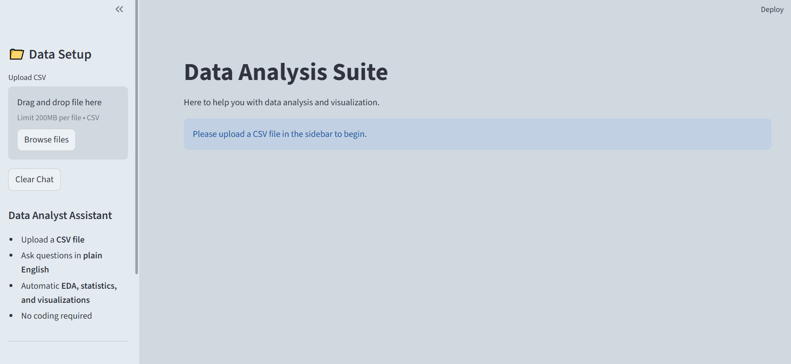

# AI Data Analysis Suite



An intelligent data analysis application powered by **Gemini AI** and **E2B Code Interpreter**. Upload a CSV file and ask questions about your data in plain English—automatic code generation, execution, and visualization.

## Features

- **AI-Powered Analysis**: Natural language queries converted to Python code
- **Instant Visualizations**: Generate charts and tables on demand
- **Secure Execution**: Code runs in isolated E2B sandbox environment
- **Exploratory Data Analysis**: Statistics, trends, and patterns
- **Chat Interface**: Multi-turn conversation with your data

## Quick Start

### Prerequisites
- Python 3.12
- Gemini API Key
- E2B API Key

### Installation
- pip insall `uv` package manager
- Clone Repository
- Create virtual Environment `uv venv`
- Install Dependencies `uv sync`

### Secrets.Tomal

```env
GEMINI_API_KEY=your_gemini_api_key
E2B_API_KEY=your_e2b_api_key
```

### Run the App

```bash
streamlit run app.py
```

Visit `http://localhost:8501` in your browser.

## How It Works

1. **Upload CSV** → File sent to E2B sandbox
2. **Ask Question** → Natural language query
3. **AI Generates Code** → Python analysis script
4. **Execute in Sandbox** → Secure, isolated environment
5. **Display Results** → Charts, tables, and insights


## Example Queries

- "What's the distribution of vote_average?"
- "Create a scatter plot of budget vs revenue"
- "Show me the top 10 movies by rating"
- "Analyze trends in release dates"

## Security

Code execution happens in a **sandboxed environment**, ensuring no access to your local system or data.

## Author

🌍 [Portfolio](https://ihtishammehmood.vercel.app/)  
💼 [LinkedIn](https://www.linkedin.com/in/ihtishammehmood/)
